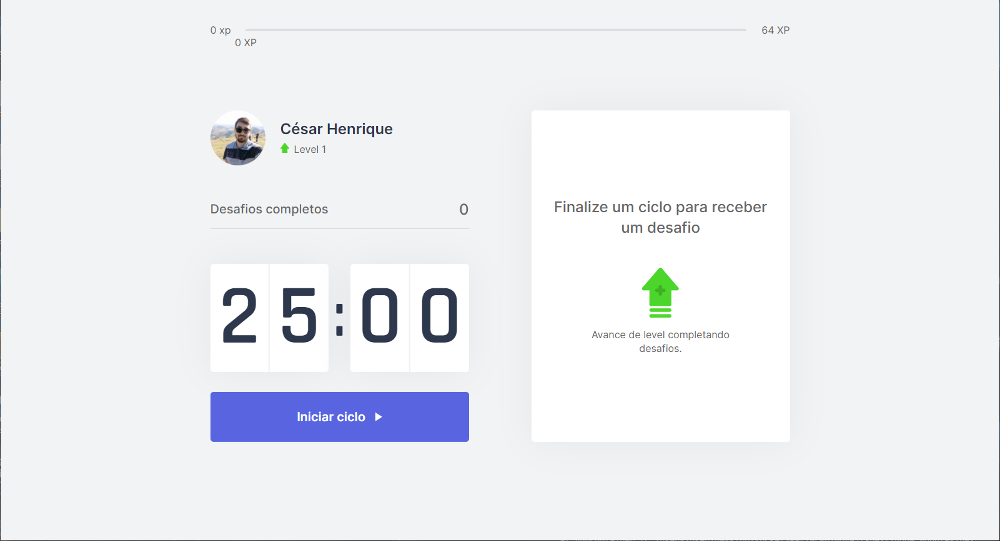

<h1 align="center">
   
</h1>

   <a href="#-tecnologias">Tecnologias</a>&nbsp;&nbsp;&nbsp;|&nbsp;&nbsp;&nbsp;
   <a href="#-projeto">Projeto</a>&nbsp;&nbsp;&nbsp;|&nbsp;&nbsp;&nbsp;
   <a href="#-layout">Layout</a>&nbsp;&nbsp;&nbsp;|&nbsp;&nbsp;&nbsp;

   
   
   

   

## 🚀 Tecnologias

Esse projeto está sendo desenvolvido com as seguintes tecnologias:
- [HTML](https://developer.mozilla.org/pt-BR/docs/Web/HTML)
- [CSS](https://developer.mozilla.org/pt-BR/docs/Web/CSS)
- [TypeScript](https://www.typescriptlang.org/)
- [NextJS](https://nextjs.org/)
- [ReactJS](https://reactjs.org/)

## 💻 Projeto

O Move.it é uma aplicação desenvolvida durante a Next Level Week #04, na trilha de ReactJS, da Rocketseat, realizada
durante os dias 22 a 28 de fevereiro de 2021, que une a técnica de Pomodoro com a realização de exercícios físicos
para quem passa muito tempo na frente do computador.

## 🔖 Layout

Você pode visualizar o layout do projeto através [desse
link](https://moveitnlw-azure.vercel.app/). Onde apresenta o aplicativo em produção.
